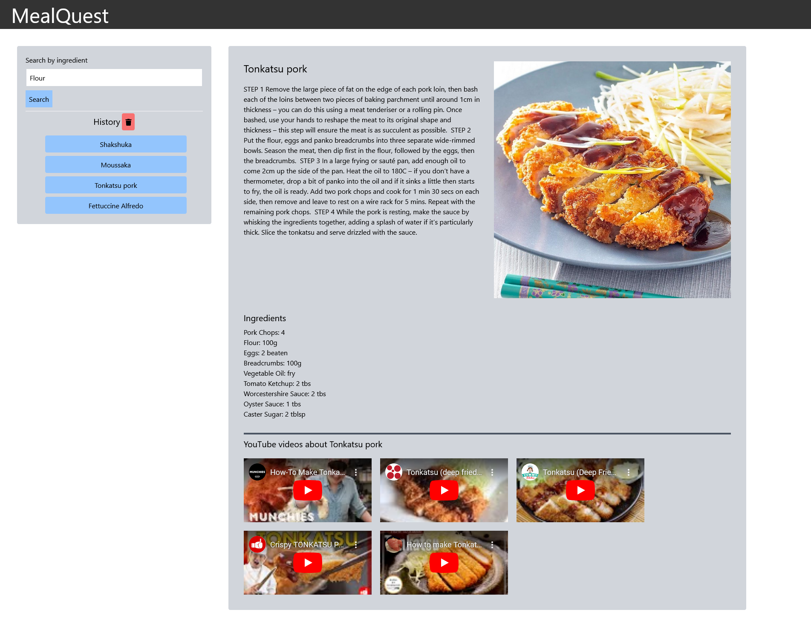

# MealQuest

## Description

MealQuest is an innovative web platform developed using HTML/CSS/JavaScript, jQuery, TailwindCSS for styling, and Font Awesome for icons. This cutting-edge platform brings together the comprehensive resources of TheMEALDB API's vast recipe database and YouTube's API for videos to deliver an unparalleled cooking experience. By inputting a single ingredient, users can instantly access a random meal featuring that ingredient along with five YouTube videos for guidance. MealQuest empowers users to explore new cuisines, enhance their cooking abilities, and make the most of the ingredients they have on hand.

https://mattlombard.github.io/MealQuest/

## Usage

To embark on your MealQuest journey, simply follow these steps: First, visit the MealQuest website on your preferred device. Then, navigate to the search bar and enter a single ingredient (e.g., "chicken") that you'd like to use in your meal. After pressing the "Search" button, allow MealQuest to work its magic. The platform will generate a random meal featuring your chosen ingredient, complete with a custom recipe. Finally, browse through the five suggested YouTube videos for more information on your meal. Experience the convenience and culinary inspiration that MealQuest provides.

## Credits

Matthew Lombard: https://github.com/MattLombard

Isaiah Galarza: https://github.com/IsaiahGz

Colt Hammond: https://github.com/ColtHammond
